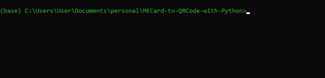
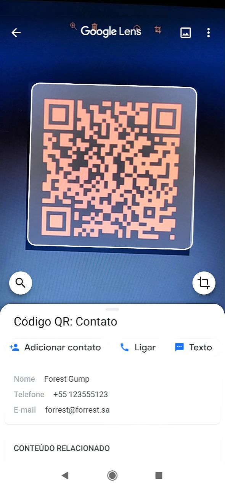

<h1> MECard-to-QRCode-with-Python </h1>
<h3> Ideia Geral</h3>

    A ideia é bem simples: você pode inserir dados de contato e salvá-los em um QR Code que, ao ser escaneado por algum
    <i>smartphone</i>, abre diretamente o aplicativo de agenda.

<h3> Como fazer isso?</h3>

    Execute o script na linha de comando e você será solicitado a digitar as informações necessárias.

<h3>O que acontece depois?</h3>

    Um arquivo de imagem com o QR Code será salvo na pasta em que o <i>script</i> estiver contido.

<h3>Demo:</h3>

  

O script pode ser modificado e mais campos podem ser adicionados. Você pode ver os campos disponíveis <a
        href="https://en.wikipedia.org/wiki/MeCard_(QR_code)">clicando aqui</a>.
